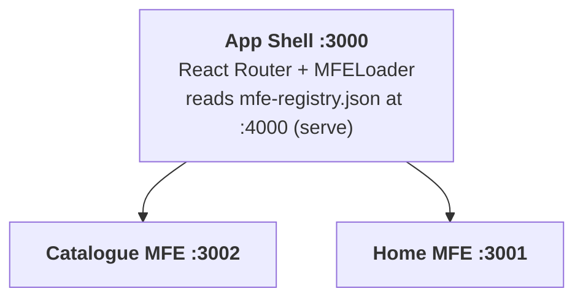

# BikeCatalogMFE

A monorepo demonstrating **client-side Micro-Frontend composition** using Vite, React, and Module Federation. The primary goal is to practice MFE architecture patterns — the content (a fictional bike brand) is incidental.

## Architecture

Client-side composition: the App Shell fetches a runtime registry, then dynamically loads each MFE's `remoteEntry.js` in the browser. No server-side stitching.




| Package                    | Port | Role                                                                     |
| -------------------------- | ---- | ------------------------------------------------------------------------ |
| `packages/app-shell`       | 3000 | Host — router, NavBar, dynamic MFE mounting                              |
| `packages/home-mfe`        | 3001 | Remote — brand landing page                                              |
| `packages/catalog-mfe`     | 3002 | Remote — bike listing with category filter                               |
| `public/mfe-registry.json` | 4000 | Served by `serve` — single source of truth for routes + remoteEntry URLs |

Adding a new MFE means adding a package under `packages/` and one entry in `mfe-registry.json` (plus its name in `app-shell/vite.config.ts` remotes for the build step).

## Tech Stack

- **Vite** — build tool for all packages
- **React 18** + **TypeScript**
- **@originjs/vite-plugin-federation** — Module Federation over Vite
- **React Router v6** — client-side routing in the shell
- **Material UI v5** — UI components, shared as a singleton across MFEs
- **pnpm workspaces** — monorepo package management (trivially convertible to polyrepo)

## Prerequisites

**Node.js 18+** and **pnpm 9+** are required.

```sh
# Check if pnpm is installed
pnpm --version

# If not, install it via npm
npm install -g pnpm
```

## Getting Started

```sh
# 1. Clone the repo
git clone <repo-url>
cd BikeCatalogMFE

# 2. Install all workspace dependencies
pnpm install

# 3. Build the remotes (required before first dev run)
#    and start all services concurrently
pnpm dev
```

This starts four processes:

| Process               | URL                                     |
| --------------------- | --------------------------------------- |
| Registry asset server | http://localhost:4000/mfe-registry.json |
| Home MFE (preview)    | http://localhost:3001                   |
| Catalog MFE (preview) | http://localhost:3002                   |
| App Shell (Vite dev)  | http://localhost:3000                   |

Open **http://localhost:3000** in your browser.

## Other Scripts

```sh
# Build all packages
pnpm build

# Build only the remote MFEs
pnpm build:remotes

# Preview a full production build
pnpm preview
```

## How It Works

1. App Shell boots and fetches `http://localhost:4000/mfe-registry.json`
2. React Router maps each registry entry to a route
3. When a route is visited, `MFELoader` calls `__federation_method_setRemote` with the remoteEntry URL from the registry, then lazily imports the exposed component
4. Shared singletons (`react`, `react-dom`, MUI, emotion) are negotiated once — no duplicate instances across MFEs

## Project Structure

```
BikeCatalogMFE/
├── public/
│   └── mfe-registry.json          # MFE route + remoteEntry registry
├── packages/
│   ├── app-shell/
│   │   └── src/
│   │       ├── components/
│   │       │   ├── NavBar.tsx
│   │       │   └── MFELoader.tsx  # dynamic federation loader
│   │       ├── hooks/
│   │       │   └── useMFERegistry.ts
│   │       └── types/
│   │           └── federation.d.ts
│   ├── home-mfe/
│   │   └── src/HomeApp.tsx        # exposes ./HomeApp
│   └── catalog-mfe/
│       └── src/CatalogApp.tsx     # exposes ./CatalogApp
├── pnpm-workspace.yaml
└── package.json                   # root scripts
```
