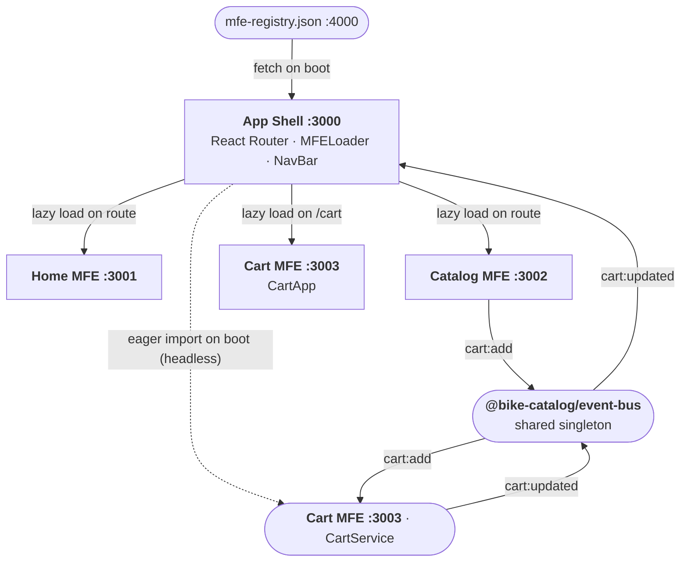

# BikeCatalogMFE

A monorepo demonstrating **client-side Micro-Frontend composition** using Vite, React, and Module Federation. The primary goal is to practice MFE architecture patterns — the content (a fictional bike brand) is not relevant.

## Architecture

Client-side composition: the App Shell fetches a runtime registry, then dynamically loads each MFE's `remoteEntry.js` in the browser.



| Package                    | Port | Role                                                                                       |
| -------------------------- | ---- | ------------------------------------------------------------------------------------------ |
| `packages/app-shell`       | 3000 | Host — router, NavBar (cart badge), dynamic MFE mounting                                   |
| `packages/home-mfe`        | 3001 | Remote — brand landing page                                                                |
| `packages/catalog-mfe`     | 3002 | Remote — bike listing; emits `cart:add` on the event bus                                   |
| `packages/cart-mfe`        | 3003 | Remote — `CartService` (always-on headless listener) + `CartApp` UI (lazy-loaded on /cart) |
| `packages/event-bus`       | n/a  | Shared singleton — typed `cartBus` (`cart:add`, `cart:remove`, `cart:updated`)             |
| `public/mfe-registry.json` | 4000 | Served by `serve` — single source of truth for routes + remoteEntry URLs                   |

Adding a new MFE means adding a package under `packages/` and one entry in `mfe-registry.json` (plus its name in `app-shell/vite.config.ts` remotes for the build step).

## Tech Stack

- **Vite** — build tool for all packages
- **React 18** + **TypeScript**
- **@originjs/vite-plugin-federation** — Module Federation over Vite
- **React Router v6** — client-side routing in the shell
- **Material UI v5** — UI components, shared as a singleton across MFEs
- **pnpm workspaces** — monorepo package management (trivially convertible to polyrepo)
- **tseep** — typed EventEmitter used by `@bike-catalog/event-bus` for cross-MFE communication

## Prerequisites

**Node.js 18+** and **pnpm 9+** are required.

```sh
# Check if pnpm is installed
pnpm --version

# If not, install it via npm
npm install -g pnpm
```

## Getting Started

```sh
# 1. Clone the repo
git clone <repo-url>
cd BikeCatalogMFE

# 2. Install all workspace dependencies
pnpm install

# 3. Build the remotes (required before first dev run)
#    and start all services concurrently
pnpm dev
```

This starts five processes:

| Process               | URL                                     |
| --------------------- | --------------------------------------- |
| Registry asset server | http://localhost:4000/mfe-registry.json |
| Home MFE (preview)    | http://localhost:3001                   |
| Catalog MFE (preview) | http://localhost:3002                   |
| Cart MFE (preview)    | http://localhost:3003                   |
| App Shell (Vite dev)  | http://localhost:3000                   |

Open **http://localhost:3000** in your browser.

> **Known limitation — `pnpm dev` vs `pnpm preview`**
>
> `@originjs/vite-plugin-federation` resolves shared singletons (including `@bike-catalog/event-bus`) through Rollup's build pipeline. Vite's dev server bypasses that pipeline, so in `pnpm dev` mode each package resolves its own copy of the event bus — cross-MFE events are silently dropped.
>
> **Use `pnpm preview` to test anything that crosses MFE boundaries** (cart events, shared state, etc.). `pnpm dev` is fine for UI-only work inside a single MFE.
>
> This is a known plugin limitation and is expected to be resolved when the project migrates to [`@module-federation/vite`](https://github.com/module-federation/core) (the official v2 implementation with proper Vite dev-mode support).

## Other Scripts

```sh
# Build all packages
pnpm build

# Build only the remote MFEs
pnpm build:remotes

# Preview a full production build
pnpm preview

# Lint all packages
pnpm lint

# Lint and auto-fix
pnpm lint:fix

# Lighthouse performance test
pnpm lighthouse


## How It Works

1. App Shell boots and fetches `http://localhost:4000/mfe-registry.json`
2. `bootstrap.tsx` eagerly imports `cartMFE/CartService` — a headless module that wires up event bus listeners immediately, before any route is visited
3. React Router maps each registry entry to a route
4. When a route is visited, `MFELoader` calls `__federation_method_setRemote` with the remoteEntry URL from the registry, then lazily imports the exposed UI component
5. Shared singletons (`react`, `react-dom`, MUI, emotion, `@bike-catalog/event-bus`) are negotiated once — no duplicate instances across MFEs
6. **Cart event flow:**
   - User clicks Add in `catalog-mfe` → `cartBus.publish('cart:add', ...)`
   - `CartService` (already loaded) receives the event, updates its internal `Map`, emits `cartBus.publish('cart:updated', { count, total })`
   - `NavBar` in the shell receives `cart:updated` and updates the badge
   - `CartApp` UI is only fetched when the user navigates to `/cart`
```
